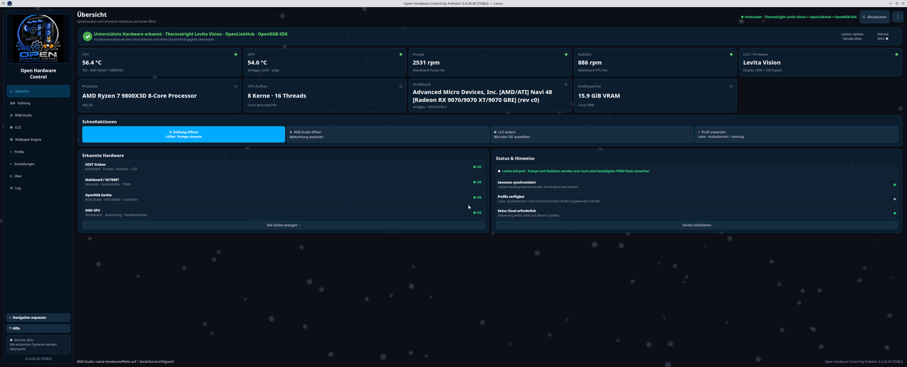
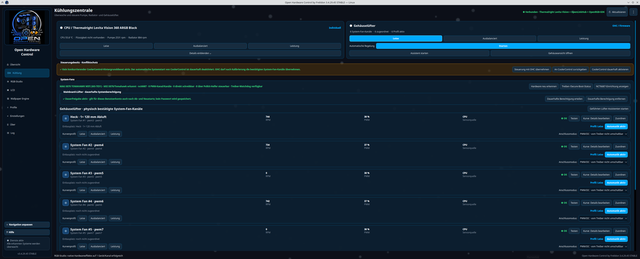
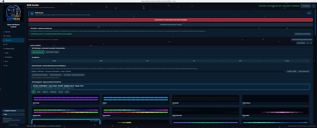
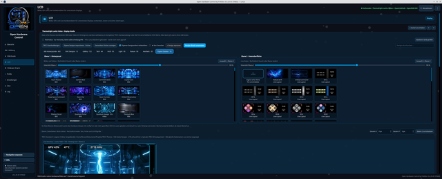
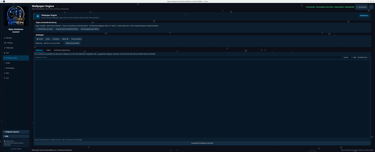
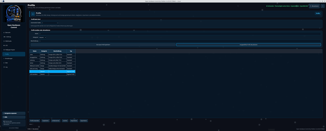
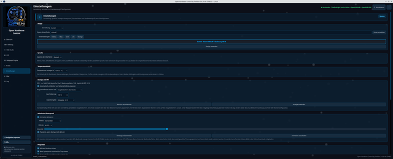

# Open Hardware Control by Frelidon 3.4.29.47

<!-- project-badges -->
[](https://github.com/Frelidon/open-hardware-control/actions/workflows/ci.yml) [](../LICENSE) [](https://github.com/Frelidon/open-hardware-control/releases)
<!-- /project-badges -->

Open Hardware Control is a free Linux GUI for the **NZXT Kraken LCD**, pump, radiator fans and RGB, for the **Thermalright Levita Vision display**, for **calibrated motherboard/case fans through Linux hwmon/NCT6687**, for **Corsair devices through OpenLinkHub** and for additional RGB devices through an automatically managed local hardware engine. It targets Fedora, Nobara, Debian, Ubuntu, Linux Mint, Arch Linux, Manjaro, EndeavourOS and openSUSE.

<!-- project-repository -->
Project repository: <https://github.com/Frelidon/open-hardware-control>
<!-- /project-repository -->

> **Unofficial independent community project:** Open Hardware Control is not supported, approved, endorsed, operated by, or affiliated with NZXT, Corsair, Thermalright, be quiet!, OpenLinkHub, OpenRGB, or any other named manufacturer or project. Product and brand names are used only to describe compatibility. Manufacturers and rights holders can contact Frelidon through the public contact address in the GitHub profile or the Steam username **Frelidon**.

## Screenshots

[](images/screenshots/01-uebersicht.png)

<table>
  <tr>
    <td align="center" width="33%">
      <a href="images/screenshots/02-kuehlung.png"></a><br>
      <sub><b>Cooling</b> · Levita/Kraken, case fans, CoolerControl guard</sub>
    </td>
    <td align="center" width="33%">
      <a href="images/screenshots/03-rgb-studio.png"></a><br>
      <sub><b>RGB Studio</b> · engine, ENE-DRAM, test mode, design gallery</sub>
    </td>
    <td align="center" width="33%">
      <a href="images/screenshots/04-lcd-levita.png"></a><br>
      <sub><b>LCD</b> · two-layer Thermalright Levita studio</sub>
    </td>
  </tr>
  <tr>
    <td align="center" width="33%">
      <a href="images/screenshots/05-wallpaper-engine.png"></a><br>
      <sub><b>Wallpaper Engine</b> · Steam Workshop and Plasma playback</sub>
    </td>
    <td align="center" width="33%">
      <a href="images/screenshots/06-profile.png"></a><br>
      <sub><b>Profiles</b> · save cooling, RGB, LCD and design together</sub>
    </td>
    <td align="center" width="33%">
      <a href="images/screenshots/07-einstellungen.png"></a><br>
      <sub><b>Settings</b> · theme, language, display, autostart</sub>
    </td>
  </tr>
</table>

<sub>Click an image for the full-size view. Same order as the sidebar in the app (German UI shown; English, Spanish and French are available).</sub>

## Thermalright Levita Vision display

**The 1600×720 display of the Thermalright Levita Vision 360 ARGB Black is supported.** The local display studio combines your own images and videos (layer 1) with a complete TRCC hardware design or freely movable OHC live values for CPU, GPU, RAM and clock (layer 2). Eleven original OHC backgrounds, two OHC data layouts and one 30-second animation ship with the app – all created by the project owner with OpenAI tools. Thermalright/TRCC catalog media is neither copied nor downloaded.

The safe preview-only test mode is active by default; real USB transfer happens only through the separately installed GPL backend **TRCC Linux** (9.9.12 recommended). Levita pump and radiator fans run through separately confirmed motherboard PWM headers (`PUMP_FAN`, `CPU_FAN`) with a safe 70 %/10 s test; CoolerControl blocks concurrent writes.

## New in 3.4.29.47

- **Fully tidied repository:** all application code now lives in `src/` (Python modules, `assets/`, `modules/`, `test-gifs/`), installer and version files in `packaging/`, every document in `docs/`, community and security policies in `.github/`. The root keeps only README, LICENSE, CITATION and a short `AGENTS.md` pointer.
- The installed layout (RPM, DEB, ZIP) stays flat and unchanged; `install.sh` is still placed directly in the extracted ZIP folder.
- From 3.4.29.46: the minutely OpenRGB device inventory pauses while OHC is hidden in the tray and no RGB action is pending; seven current screenshots and a compact README.

Older versions: [Version history](#version-history) · [CHANGELOG.md](CHANGELOG.md) · [docs/releases/](releases)

## Installation

### Fedora and Nobara – RPM

Download `open-hardware-control-3.4.29.47-1.noarch.rpm` to your Downloads folder and run:

```bash
cd ~/Downloads
sudo dnf install ./open-hardware-control-3.4.29.47-1.noarch.rpm
```

### Debian, Ubuntu and Linux Mint – DEB

Download `open-hardware-control_3.4.29.47_all.deb` to your Downloads folder and run:

```bash
cd ~/Downloads
sudo apt install './open-hardware-control_3.4.29.47_all.deb'
```

### Universal installer – ZIP

For Fedora/Nobara, Debian/Ubuntu/Mint, Arch/Manjaro/EndeavourOS and openSUSE. Download `open_hardware_control_v3_4_29_47.zip` and run:

```bash
cd ~/Downloads
unzip open_hardware_control_v3_4_29_47.zip
cd open-hardware-control-3.4.29.47
chmod +x install.sh
./install.sh
```

An existing installation is updated in place. Afterwards **Open Hardware Control by Frelidon** appears in the application menu, or start `~/.local/bin/open-hardware-control` from a terminal (the legacy command `kraken-control` still works). The dependency check detects the common package managers automatically; every distro-specific command is listed in [INSTALL.md](INSTALL.md).

Optional and installed separately according to their official guides: **OpenLinkHub** (Corsair), **TRCC Linux** (Levita display), **OpenRGB** (additional RGB devices), **CaptSilver Wallpaper Engine plugin** (KDE). OHC bundles none of these components and does not modify them.

## Security

- Writes only reach matching, detected devices: Kraken through liquidctl, Corsair through a fixed validated action list, motherboard PWM only after physical confirmation.
- OpenLinkHub and OpenRGB are addressed exclusively over loopback (`127.0.0.1`); OpenRGB only in explicit `--client` mode against the local SDK server `127.0.0.1:6742`.
- RGB/Corsair write permissions apply to the current session only; competing devices (NZXT ↔ OpenRGB, Corsair ↔ OpenLinkHub) stay locked.
- Polkit grants store no password; system-wide services are never changed automatically. No firmware updates, no cloud, no telemetry.
- Details: [SECURITY.md](../.github/SECURITY.md) · [docs/security/](security)

## Documentation

| Folder | Contents |
|---|---|
| [INSTALL.md](INSTALL.md) · [CHANGELOG.md](CHANGELOG.md) | per-distribution installation, complete change history |
| [docs/hardware/](hardware) | [Supported devices](hardware/SUPPORTED_DEVICES.en.md), [Profiles](hardware/PROFILES.md), [CPU profiles](hardware/CPU_PROFILES.en.md), [RGB Studio](hardware/RGB_STUDIO.md), [OpenLinkHub integration](hardware/OPENLINKHUB_INTEGRATION.md), USB capture findings |
| [docs/project/](project) | [Architecture](project/ARCHITECTURE.md), [Project status](project/PROJECT_STATUS.md), [Module registry](project/MODULE_REGISTRY.md), [Project scope](project/PROJECT_SCOPE.en.md), roadmap, decisions |
| [docs/security/](security) | RGB/desktop security audits, [Privacy](security/PRIVACY.md), scan report |
| [src/](../src) | application code: `kraken_control.py` (entry point), feature modules under `src/modules/`, artwork under `src/assets/` |
| [docs/ai/](ai) | working guides for local and web-based coding assistants |
| [docs/releases/](releases) | release notes for every version, release checklist |
| [packaging/](../packaging) | `install.sh`/`uninstall.sh`, `VERSION`, `BUILD_CHANNEL`, udev rule, Polkit policy, metainfo, desktop file, helper scripts |

German version: [README.md](../README.md)

## Status

Public experimental beta, provided without warranty. Channel **STABLE**, license **GPL-3.0-or-later**. Contributing: [.github/CONTRIBUTING.md](../.github/CONTRIBUTING.md) · Help: [.github/SUPPORT.md](../.github/SUPPORT.md) · Security reports: [SECURITY.md](../.github/SECURITY.md)

## Modules

### NZXT Kraken 2023

RGB, images, GIFs, clock, static and animated live hardware designs, CPU/GPU live values, software-controlled CPU temperature curves for pump and fans, profiles, four languages and an LCD safety fallback. During an LCD animation Kraken status polling stays paused; required pump/fan changes run as a short exclusive USB transaction before the streamer takes over again.

| Device | USB ID | Scope |
|---|---|---|
| NZXT Kraken 2023 | `1e71:300e` | liquid, pump, radiator fans, LCD |
| NZXT 2023 RGB Controller | `1e71:2012` | three RGB channels |

### Thermalright Levita Vision

Two-layer display studio (see above), import of local images, videos, `.zt` files and TRCC layout folders, TRCC categories Gallery/Tech/HUD/Light/Nature/Aesthetic, favourites, a custom design folder, autostart of both layers and cooling through confirmed motherboard PWM headers.

### Motherboard and case fans

Linux hwmon/NCT6687 (e.g. MSI X870 family). Every PWM channel is unlocked only after a short physical test; afterwards Silent/Balanced/Performance, custom curves, sensor source, hysteresis, PWM/DC switching only through an existing `pwmN_mode`, a guided fan assistant and hand-back to BIOS/firmware on exit.

### Corsair · OpenLinkHub

Exclusively through the local API `http://127.0.0.1:27003`. Documented write commands for cooling, RGB/LCD, mouse, keyboard and headset; controls only for detected devices. User and system services are detected separately; system-wide changes are never made automatically.

### RGB Studio · OpenRGB SDK

OHC starts a private windowless OpenRGB process on demand and uses only the local SDK endpoint. Detected devices, zones, LEDs and modes, static colours, native hardware modes, OHC animations (Direct mode), a device test mode, ENE-DRAM cold-start reinitialisation and a saved startup profile.

### Wallpaper Engine for KDE

Reads only local Steam Workshop metadata, selects wallpapers through Plasma's official scripting configuration and controls playback through the local D-Bus object of the separately installed CaptSilver plugin. Guided setup for Steam, subscriptions and the plugin; on Fedora an optional verified RPM download with SHA256 comparison and a second confirmation before Polkit/DNF.

## Version history

**3.4.29.47** – Application code moved to `src/`, installer/version files to `packaging/`, all documents to `docs/`; the root holds only README, LICENSE, CITATION and the AGENTS pointer.

**3.4.29.46** – OpenRGB inventory pauses in the tray; repository sorted into topic folders; new screenshots and compact README.

**3.4.29.45** – A saved RGB startup profile is no longer lost when OpenRGB reports a partial cold-start inventory; module-registry check supports the STABLE channel; first stable release of the 3.4.29 line (Levita, RGB, Wallpaper, fans, diagnostics, KDE/Wayland).

**3.4.29.42** – Wallpaper playback buttons use the registered Plasma D-Bus object; three CaptSilver scaling modes; selectable start screen with safe fallback; uniformly narrow scrollbars.

All earlier versions back to 2.9.x: [CHANGELOG.md](CHANGELOG.md) and [docs/releases/](releases).
